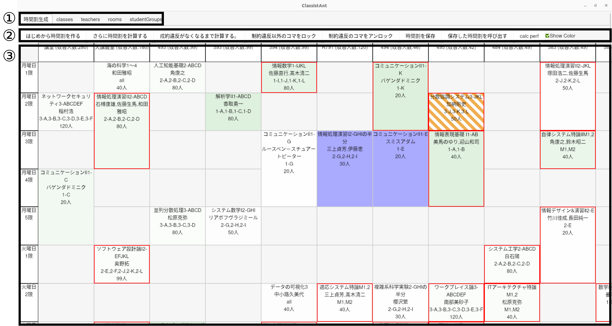
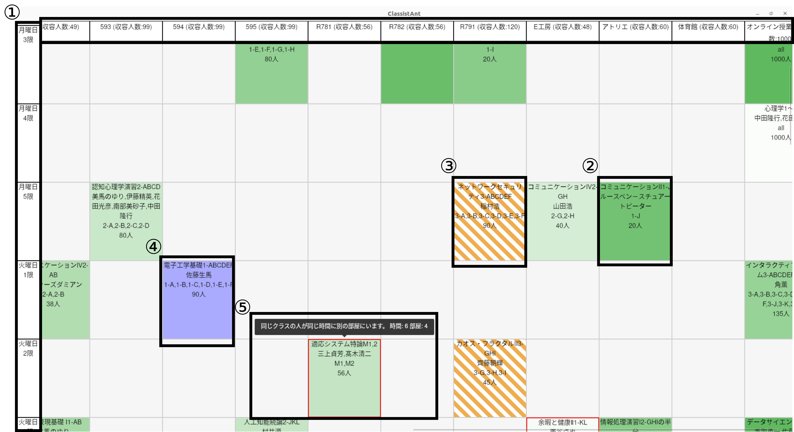

# プロジェクト名

## 概要

このプロジェクトは **Tauri** を用いて開発されたデスクトップアプリケーションであり、時間割を編成をするためのインターフェースを提供します。

## インストール

```sh
git clone https://github.com/username/repository.git
cd repository
yarn install
yarn tauri dev
```

## 使い方

時間割作成のためのテーブル形式インターフェースを中心に、以下の3つのエリアで構成されています。



1. **画面遷移のタブ**: 他の画面への迅速な遷移が可能。
2. **時間割操作ボタン**: 時間割の作成や編集を効率化。
3. **テーブル形式のインターフェイス**: 縦軸を時間、横軸を部屋としたグリッド形式。

### 


1. **時間割の教室表示**: 時間の軸を左側に，部屋の軸を上側に配置し，スクロールしても画面を追従する．
2. **移動確率の可視化**: アルゴリズムによるコマの安定性を示すため，次世代でコマが移動する確率を緑色の濃淡で表示．濃いほど移動確率が低いことを示す．
3. **特に移動確率の高いコマの強調表示**: とくに移動確率が高いコマは斜線で表示され，アルゴリズムによる移動確率が高いことを視覚的に認識しやすい．
4. **ロック済のセルの表示**: ロックされたコマは水色で表示され，アルゴリズムによる変更を防ぐ．
5. **制約違反の表示**: 制約違反があるコマは赤枠で強調表示され，視覚的に認識しやすい．


## ライセンス

[MIT](LICENSE)
